<p align="center">
  <h1 align="center">Zebrash</h1>
  <p align="center">Render <strong>ZPL</strong> (Zebra Programming Language) labels to <strong>PNG</strong>, <strong>PDF</strong> &amp; <strong>SVG</strong> — no printer, no cloud, no cost.</p>
  <p align="center">
    <a href="https://pkg.go.dev/github.com/swiftpush/zebrash"></a>
    <a href="https://goreportcard.com/report/github.com/swiftpush/zebrash"></a>
    
    <a href="LICENSE"></a>
  </p>
  <p align="center">
    
  </p>
</p>

## 🔧 New maintainer
> This is a fork of the [ingridhq/zebrash](https://github.com/ingridhq/zebrash) library

## ✨ Features

- 📦 **Emulates a real subset of the ZPL engine** — handles the labels carriers like FedEx, UPS, DHL, USPS, DPD and GLS actually emit.
- 🖨️ **No hardware required** — preview ZPL without owning a Zebra-compatible printer.
- 🎨 **Three output formats** — raster `PNG` (monochrome or 8-bit grayscale), single-page vector `PDF`, and `SVG`.
- 🔒 **Runs entirely locally** — labels never leave your machine, so customer data stays private.
- ⚡ **Drop-in Go library** — parse and render in a handful of lines, no external services to call.
- 💸 **Free for commercial use** — MIT-licensed, with no API limits.

## 🔒 Self-hosted, free, and private

Zebrash runs entirely inside your own application or infrastructure — there is no API to call and nothing to sign up for.

- **It's free.** No per-call quotas, no API keys, no subscription tiers. The library is MIT-licensed and free for commercial use.
- **Your data never leaves your machine.** Shipping labels carry real customer names, addresses, and tracking numbers. Because parsing and rendering happen locally, none of that is ever transmitted to a third party.
- **No external dependencies at runtime.** Zebrash works fully offline, with no outbound network calls, meaning no dependencies on third-party services.

## 🖼️ Examples

A few sample renders (more examples can be found inside the `testdata` folder):

| UPS | FedEx | DHL Paket | Amazon | Posten |
| :---: | :---: | :---: | :---: | :---: |
|  |  |  |  |  |

## 📦 Install

```bash
go get github.com/swiftpush/zebrash
```

## 🚀 Usage

Parsing ZPL into one or more labels is the first step; you then render any label to the format you want.

```go
package main

import (
	"log"
	"os"

	"github.com/swiftpush/zebrash"
	"github.com/swiftpush/zebrash/drawers"
)

func main() {
	exampleZPL := "^XA^FO50,50^FDHello World^FS^XZ"

	// Stage 1 — parse the ZPL into labels.
	parser := zebrash.NewParser()
	labels, err := parser.Parse([]byte(exampleZPL))
	if err != nil {
		log.Fatal(err)
	}

	// Stage 2 — render the first label to a PNG.
	out, err := os.Create("label.png")
	if err != nil {
		log.Fatal(err)
	}
	defer out.Close()

	drawer := zebrash.NewDrawer()
	err = drawer.DrawLabelAsPng(labels[0], out, drawers.DrawerOptions{
		LabelWidthMm:         101.6,
		LabelHeightMm:        203.2,
		Dpmm:                 8,
		EnableInvertedLabels: true,
		GrayscaleOutput:      true,
	})
	if err != nil {
		log.Fatal(err)
	}
}
```

The same parsed label can be rendered to other formats — the only thing that changes is the draw call:

<details>
<summary><strong>PDF</strong></summary>

```go
err = drawer.DrawLabelAsPdf(labels[0], out, drawers.DrawerOptions{
	LabelWidthMm:  101.6,
	LabelHeightMm: 203.2,
	Dpmm:          8,
})
```
</details>

<details>
<summary><strong>SVG</strong></summary>

```go
err = drawer.DrawLabelAsSvg(labels[0], out, drawers.DrawerOptions{
	LabelWidthMm:  101.6,
	LabelHeightMm: 203.2,
	Dpmm:          8,
})
```
</details>

## 📋 ZPL Command Support

A full breakdown of which ZPL commands Zebrash supports, which are planned, and which are out of scope (hardware-only) is maintained in [`docs/zpl-command-support.md`](docs/zpl-command-support.md).

## 🤝 Contributing

Contributions are welcome! Please submit an issue or pull request.
For larger changes, please open an issue first to discuss the approach.

## 📄 License

This project is licensed under the **MIT License** — see the [LICENSE](LICENSE) file for details.
